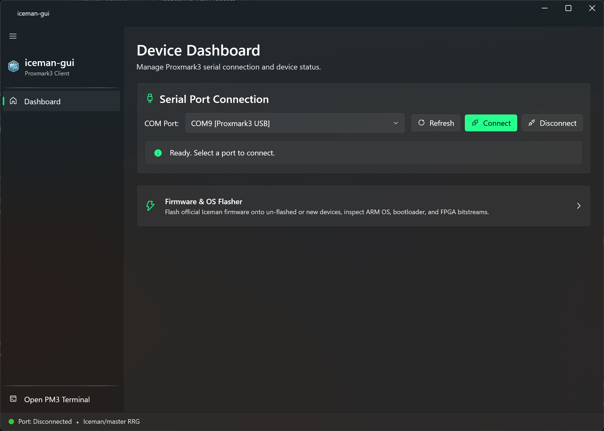
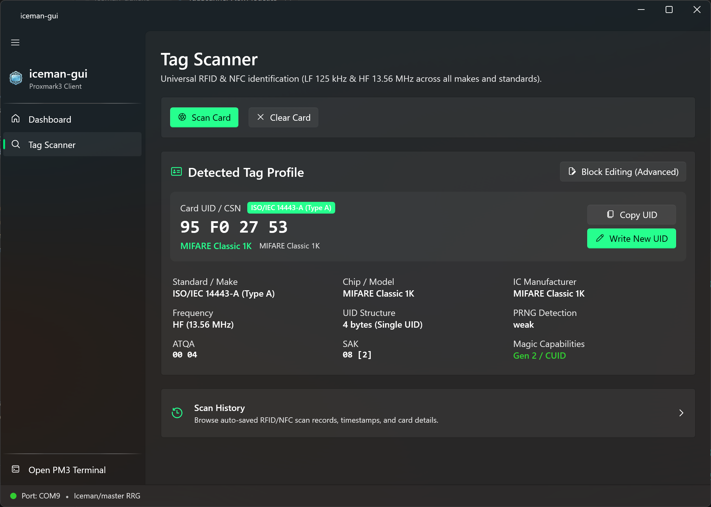
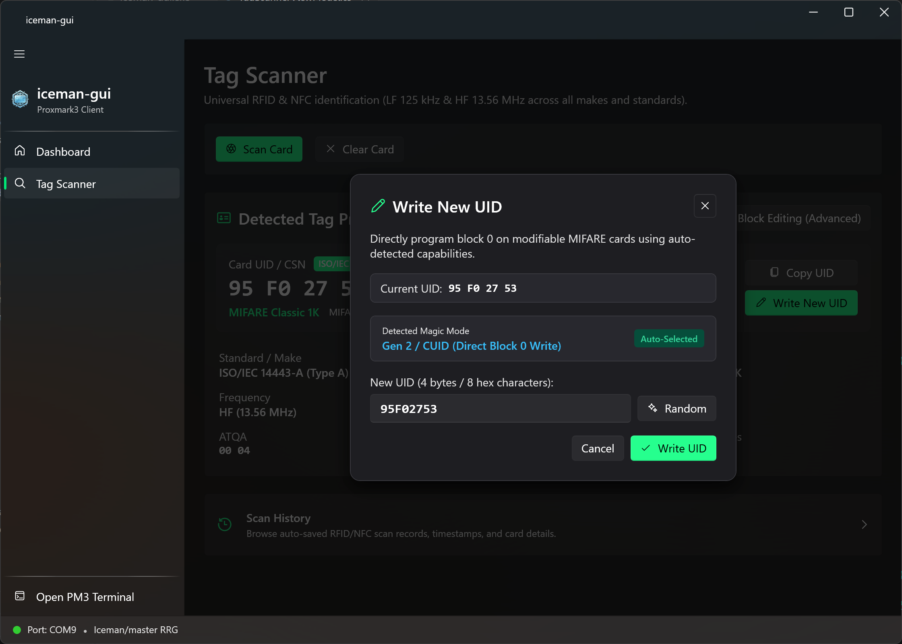
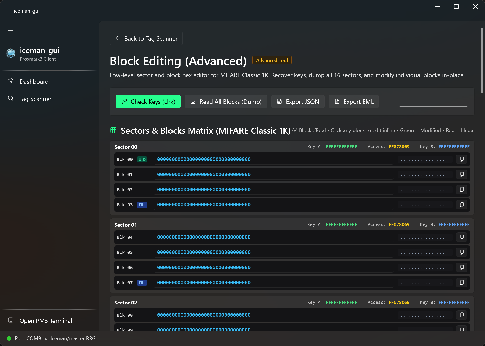
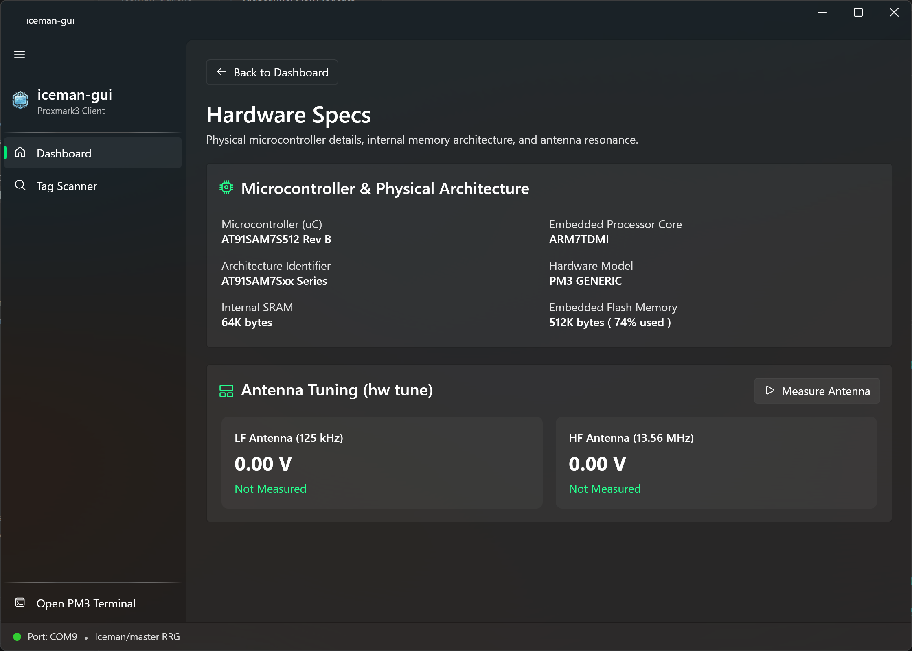
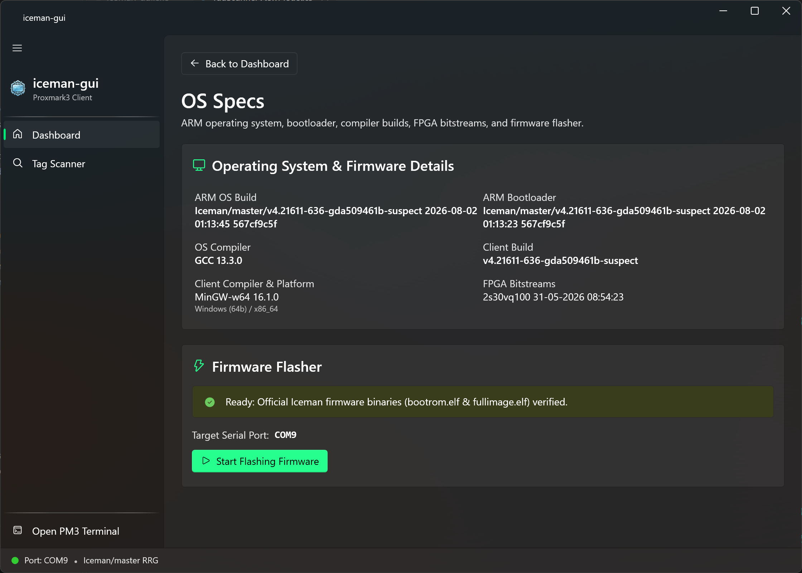

<div align="center">
  

  <br /><br />

  [](https://www.gnu.org/licenses/gpl-3.0)
  [](https://dotnet.microsoft.com/)
  [](https://microsoft.com/windows)
  [](https://github.com/RfidResearchGroup/proxmark3)

  <p><strong>A modern, high-performance Windows 11 Fluent UI desktop client designed for the Proxmark3 (Iceman / RfidResearchGroup) distribution.</strong></p>
</div>

`iceman-gui` simplifies everyday RFID and NFC workflows—device connection, hardware diagnostics, antenna tuning, tag identification, magic UID writing, firmware flashing, and low-level MIFARE Classic sector editing—while preserving raw command-line speed through an unbuffered one-click external terminal.

---

## Visual Showcase

### 1. Device Dashboard & Connection Management
Connect instantly to Proxmark3 devices via auto-detected USB COM ports, inspect connection health, and access the built-in firmware flasher.

<div align="center">
  
</div>

<br />

### 2. Universal Tag Scanner & Card Profile
Place any RFID/NFC tag on the antenna to reveal its UID, standard, manufacturer, chip model, ATQA, SAK, PRNG behavior, and magic capabilities (Gen 1a, Gen 2 CUID).

<div align="center">
  
</div>

<br />

### 3. Magic UID Programming (Gen 1a & Gen 2 CUID)
Program a new UID in seconds with auto-detected magic backdoor capabilities and built-in random UID generation.

<div align="center">
  
</div>

<br />

### 4. Block Editing (Advanced) & Inline Hex Matrix
For low-level security research and card cloning: recover sector keys (`hf mf chk`), dump all 16 sectors, edit individual blocks in-place with real-time green/red validation, and export to JSON or EML.

<div align="center">
  
</div>

<br />

### 5. Hardware Specifications & Real-time Antenna Tuning
Inspect microcontroller architecture (AT91SAM7S512, SRAM, Flash memory) and perform antenna resonance voltage tuning (`hw tune`) across LF (125 kHz) and HF (13.56 MHz).

<div align="center">
  
</div>

<br />

### 6. Operating System, Firmware & One-Click Flasher
Review ARM OS builds, bootloader revisions, GCC/MinGW compiler toolchains, FPGA bitstreams, and flash official Iceman firmware (`bootrom.elf` & `fullimage.elf`) directly from the GUI.

<div align="center">
  
</div>

---

## Feature Tour

| Feature | Description |
| :--- | :--- |
| **Serial Connection** | Instant Windows registry detection (`HARDWARE\DEVICEMAP\SERIALCOMM`) identifying Proxmark3 USB CDC ports automatically. |
| **Tag Identification** | Extracts UID, ATQA, SAK, PRNG behavior, and detects magic card capabilities (Gen 1a, Gen 2 CUID). |
| **Magic Tag Writer** | Direct Block 0 programming for Gen 2 (CUID) or Gen 1a backdoor cards with auto-capability detection. |
| **Block Editing (Advanced)** | 64-block high-density interactive hex grid with real-time validation (Green = modified, Red = illegal) and direct block write. |
| **Dump & Export** | Inspect full 64-block dumps and export card profiles to structured JSON or standard `.eml` files. |
| **Antenna Resonance** | Real-time voltage measurement (`hw tune`) for both LF (125 kHz) and HF (13.56 MHz) antennas. |
| **Hardware Inspection** | Displays ARM OS version, bootloader build, microcontroller model, and flash memory status. |
| **Firmware Flasher** | Validates `bootrom.elf` and `fullimage.elf`, manages bootloader unlocking, and provides automated flashing. |
| **External Terminal** | Instant access to unbuffered native Windows Command Prompt with full Iceman environment. |

---

## Installation & Running

### Option A: Portable Run (.NET SDK)
If you have the .NET 10 SDK installed:
```powershell
dotnet run
```

### Option B: Standalone Release Package
1. Run `./package.ps1` to create a standalone self-contained folder under `dist/iceman-gui/`.
2. Extract or move the folder to your Proxmark3 directory (or keep it standalone).
3. Launch `iceman-gui.exe`.

---

## License & Attribution

- **`iceman-gui`** is released under the **[GNU General Public License v3.0 (GPL-3.0)](LICENSE)**.
- Proxmark3 client binaries and firmware are copyright [RfidResearchGroup](https://github.com/RfidResearchGroup/proxmark3) and contributors under GPL-3.0.
