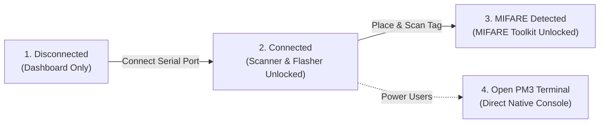

# PM3 Iceman GUI

[](https://www.gnu.org/licenses/gpl-3.0)
[](https://dotnet.microsoft.com/)
[](https://microsoft.com/windows)
[](https://github.com/RfidResearchGroup/proxmark3)

A modern, high-performance Windows 11 Fluent UI desktop client designed for the **Proxmark3 (Iceman / RfidResearchGroup)** distribution.

`iceman-gui` simplifies everyday RFID and NFC workflows—device connection, hardware diagnostics, antenna tuning, tag identification, firmware flashing, and MIFARE Classic sector editing—while preserving raw command-line speed through an unbuffered one-click external terminal.

---

## Highlights & Philosophy

### 1. Progressive Disclosure ("One Step at a Time")
Rather than overwhelming you with hundreds of esoteric commands upfront, `iceman-gui` guides your workflow organically:
- **Disconnected**: Only the **Dashboard** is visible. Pick your COM port and connect.
- **Connected**: The app reads hardware specs (ARM OS, FPGA version, client build), measures antenna voltages, and unlocks the **Tag Scanner** and **Firmware Flasher**.
- **Card Discovered**: When an ISO14443-A or MIFARE Classic card is detected, the **MIFARE Toolkit** is dynamically revealed in the navigation.



### 2. Pure Windows 11 Fluent UI
- Built with **WPF + [WPF-UI](https://github.com/lepoco/wpfui)** with native Windows 11 Mica material and dark mode styling.
- Compact **Navigation Rail** (`ui:NavigationView`) with native indicator selection pills (no rounded button borders).

### 3. High-Contrast Sector & Block Matrix
- Replaces legacy tables with pure Fluent UI expander cards (`ui:CardExpander`) for all 16 sectors.
- Distinct color-coded pills for **Key A** (`#22C55E` green), **Access Bits** (`#EAB308` amber), and **Key B** (`#3B82F6` blue).
- Dark monospaced byte blocks (`#141416` / `#38BDF8`) with grouped byte formatting (`8B 12 31 BA ...`).
- One-click block editing and clipboard copying.

### 4. Direct CUID / Magic Card Cloning
- Modify Block 0 and change the UID of Gen 2 (CUID) magic cards directly.
- Automatically calculates and verifies the Byte Check Character (BCC XOR checksum).
- Employs `--force` write to ensure reliable writeback on supported transponders.

### 5. Native Unbuffered Terminal (Zero Latency & No Recording)
- Need raw command flexibility? The **"Open PM3 Terminal"** button spawns a native Windows Command Prompt connected directly to your Proxmark3 via `pm3.bat <PORT>`.
- Zero GUI interception, zero command recording, and 100% compatibility with interactive PM3 commands and Lua scripts.

---

## Feature Tour

| Feature | Description |
| :--- | :--- |
| **Serial Connection** | Instant Windows registry detection (`HARDWARE\DEVICEMAP\SERIALCOMM`) identifying Proxmark3 USB CDC ports automatically. |
| **Hardware Inspection** | Displays ARM OS version, bootloader build, microcontroller model, and flash memory status. |
| **Antenna Resonance** | Real-time voltage measurement (`hw tune`) for both LF (125 kHz) and HF (13.56 MHz) antennas. |
| **Tag Identification** | Extracts UID, ATQA, SAK, PRNG behavior, and detects magic card capabilities (Gen 1a, Gen 2 CUID). |
| **Dump & Export** | Inspect full 64-block dumps and export card profiles to structured JSON or standard `.eml` files. |
| **Firmware Flasher** | Validates `bootrom.elf` and `fullimage.elf`, manages bootloader unlocking, and provides an emergency recovery guide. |

---

## Quick Start & Portable Usage

### Requirements
- **Operating System**: Windows 11 or Windows 10 (x64)
- **Runtime**: [.NET 10 Desktop Runtime](https://dotnet.microsoft.com/download/dotnet/10.0) (or SDK)
- **Proxmark3**: A compiled [RRG / Iceman distribution](https://github.com/RfidResearchGroup/proxmark3)

### Installation
1. Download the latest `iceman-gui-windows-x64.zip` from [Releases](https://github.com/your-username/iceman-gui/releases).
2. Extract the archive.
3. Place `iceman-gui.exe` (and its DLLs) into your Proxmark3 root directory (the folder containing `pm3.bat` and `client/`), or anywhere on your system.
4. Run `iceman-gui.exe`.

> [!TIP]
> **Portable Path Auto-Discovery**: `iceman-gui` automatically searches for `client/proxmark3.exe` in:
> 1. The application's working directory.
> 2. Parent and sibling directories.
> 3. User `Downloads/proxmark3`.
> 4. System `PATH`.

---

## Building from Source

### Prerequisites
- [.NET 10.0 SDK](https://dotnet.microsoft.com/download/dotnet/10.0)
- Git

### Build Instructions
```powershell
# 1. Clone repository
git clone https://github.com/your-username/iceman-gui.git
cd iceman-gui

# 2. Restore dependencies
dotnet restore

# 3. Build release executable
dotnet build -c Release

# 4. Publish portable binaries
dotnet publish -c Release -r win-x64 --self-contained false -o bin\Release\publish
```

### Automated Hardware Verification Mode
You can run the built-in automated hardware and card test suite against a physical Proxmark3:
```powershell
.\bin\Release\publish\iceman-gui.exe --test
```
This tests:
1. Port detection and hardware specs query (`hw version`).
2. Firmware binaries validation (`bootrom.elf` / `fullimage.elf`).
3. Tag discovery and UID extraction.
4. Sector key checking and dump file generation.
5. CUID Block 0 UID modification and readback verification.

---

## Architecture

```
iceman-gui/
├── Core/
│   ├── ChildProcessTracker.cs         # Windows Job Object ensuring all child processes close with GUI
│   ├── HardwareVerificationRunner.cs   # End-to-end automated test runner (--test)
│   ├── Pm3EnvironmentResolver.cs      # Portable path resolver for client/proxmark3.exe
│   ├── Pm3ProcessService.cs           # Process execution manager with unbuffered I/O (-f -w)
│   └── SerialPortDetector.cs          # Instant registry-based COM port detection
├── Models/
│   ├── HardwareInfo.cs                # Model, firmware, ARM OS, processor, voltages
│   ├── MifareCardData.cs              # 16 sectors, 64 blocks, FormattedHex, JSON & EML export
│   └── TagInfo.cs                     # UID, ATQA, SAK, Frequency, Tech, Magic type
├── Services/
│   ├── FlasherService.cs              # Validates firmware files and coordinates flashing
│   ├── HardwareService.cs             # hw version and hw tune parsing
│   ├── MifareService.cs               # Sector key checking, block dumping, CUID UID writer
│   └── TagScanService.cs              # Fast ISO14443-A & full HF/LF search
├── ViewModels/
│   ├── DashboardViewModel.cs          # Port selection, connect/disconnect, hardware specs, sub-page navigation
│   ├── FlasherViewModel.cs            # Consolidated single-card firmware flasher & recovery guide
│   ├── MainViewModel.cs               # Progressive disclosure state & navigation routing
│   ├── MifareToolkitViewModel.cs      # Pure Fluent UI matrix, block editing, UID change
│   └── TagScannerViewModel.cs         # Tag discovery and unlock triggers
└── Views/
    ├── DashboardPage.xaml             # Connection, hardware specs & antenna sub-page, consolidated flasher
    ├── MifareToolkitPage.xaml         # Pure Fluent UI CardExpander matrix
    ├── TagScannerPage.xaml            # Card profile & MIFARE unlock banner
    ├── MainWindow.xaml                # Fluent Navigation Rail shell
    └── MainWindow.xaml.cs             # Two-way navigation synchronization
```

---

## License & Attribution

- **`iceman-gui`** is released under the **[GNU General Public License v3.0 (GPL-3.0)](LICENSE)**.
- Proxmark3 client binaries and firmware are copyright [RfidResearchGroup](https://github.com/RfidResearchGroup/proxmark3) and contributors under GPL-3.0.
